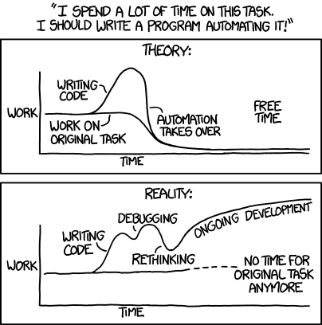

#  Automate More - Remember Less

<small>René Fritze</small>  
<small>rene.fritze@wwu.de</small>  
<small>Mathematics Münster</small>  
  
<small>March 23, 2022</small>
  
<small>**</small>  

---

# Why automate tasks

1. So I cannot forget (how) to run the task
2. Increase reliability
3. Save myself time

---

# Caveats I

---

# Caveats II

---

# 
  - launch scripts

---

# pre-commit

## Available hooks:
  - formatter
    black, prettier
  - large files
  - credentials
  - linting
  - MORE

## Write your own hook
  
---

# Makefiles

---

# CI

## Gitlab CI

## Github Actions

---

# project template sanity
if your project configuration from tempalte
  
